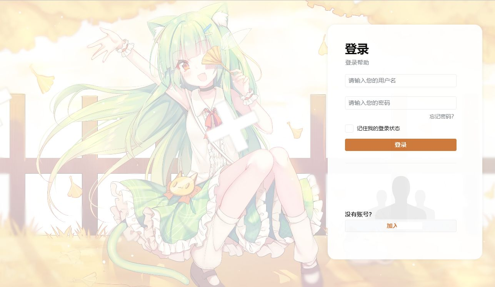
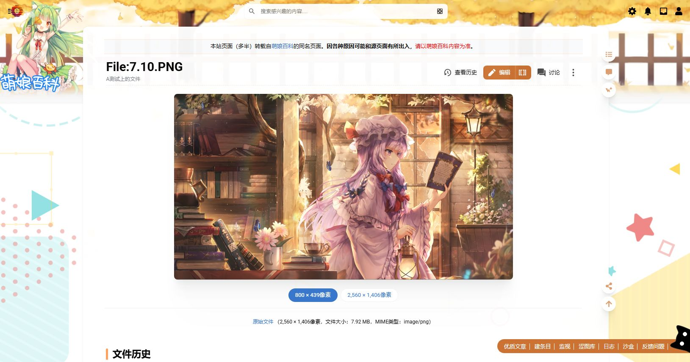
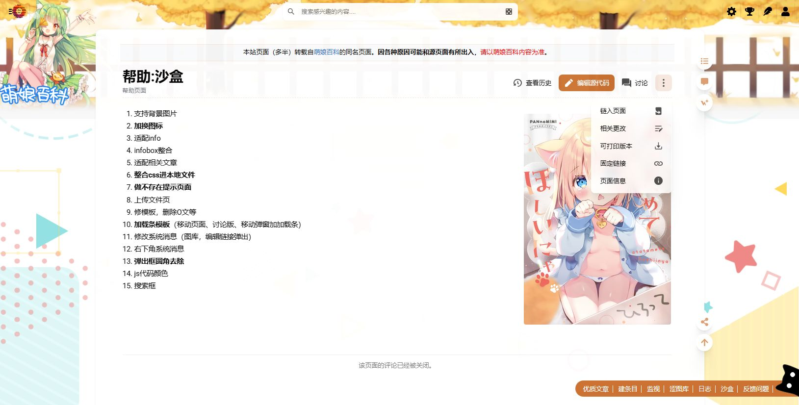
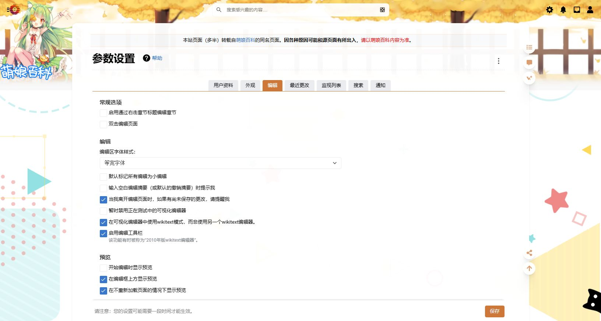
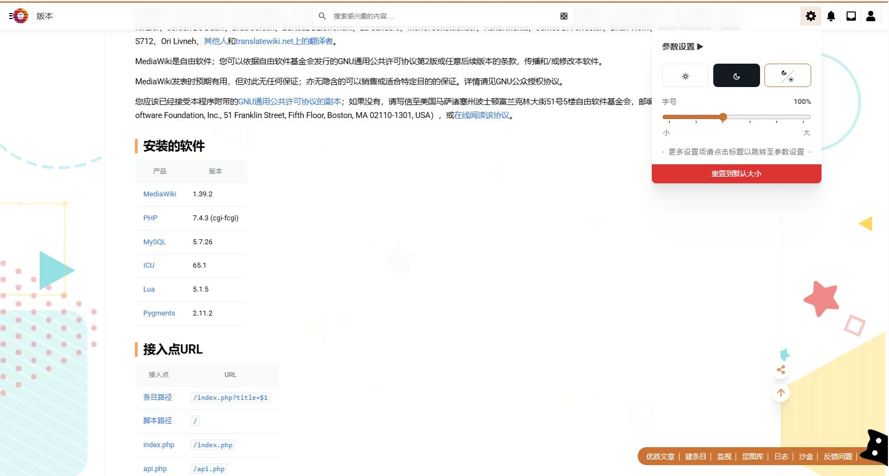

<h1>MoeSkin+</h1>

注意该皮肤制作完成于2022年，适用于MW1.39左右版本，现已完全过时，不再维护。

## 皮肤特色
- 👀懒加载：使用分级加载节省服务器资源，加快网页响应速度
- 📖响应式布局：自适应屏幕尺寸，在手机/平板/电脑等不同设备采用不同的布局
- 🌙亮暗主题：跟随系统，或在浅色模式和深色模式之间轻松切换
- 🕹️悬浮按钮菜单：目录/评论/编辑/分享...各种操作现在都变得触手可及
- 🪀可折叠分区：通过点按文章内段落标题折叠展开分区
- 🐣丰富的搜索建议：包含图片和说明的富媒体搜索建议
- 🕸️快速字号设置：可按喜好调整字体大小，获得更友好的阅读体验
- 🔗扩展设计改进：大幅改进插件的界面设计，为网站量身定做，使之更具人性化

## 特殊性设计
- 此皮肤适配所有屏幕大小，但视图显示略有差异：
  - 在手机视图上不会显示背景图片，消息系统也会被隐藏至用户菜单，同时部分不适合窄视图的元素将会被改变或隐藏
  - 在低于10寸的视图下搜索栏会隐藏以适配窄屏，您需要点击搜索按钮以调出
- 主体显示区域大小更改为（约）1200px，为适合所有条目设计
- 界面是分段从服务器获取的，并非先文字后图片，页脚为最后获取展示
- 请尽量使用`<gallery mode="packed">`模式的画廊，该模式已适配现代化风格
- 页顶编辑按钮为新版编辑器，右侧编辑按钮为旧版编辑器
- 增加“/”快捷键为搜索
- 使用全局根元素调色板设计界面，可以随意更改

## 安装&配置
- 在LocalSettings.php里面加入：
<pre>
$wgDefaultSkin = "MoeSkin";
wfLoadSkin( 'MoeSkin' );
</pre>
- 手动将MoeSkin.css里的内容加入到全站css里
- 其他可以参考同目录下的LocalSettings配置文件

## 迁移设计
- 写皮肤帮助说明可参考：https://wiki.unitedearth.cc/%E5%B8%AE%E5%8A%A9:%E5%B8%AE%E5%8A%A9%E4%B8%AD%E5%BF%83
- 顶部模板，信息栏，大家族设计可参考：https://citizenwiki.cn/%E7%BD%97%E4%BC%AF%E8%8C%A8%E5%A4%AA%E7%A9%BA%E5%B7%A5%E4%B8%9A
- 小工具可参考：https://www.qiuwenbaike.cn/wiki/Special:Gadgets

## 使用注意
- 本皮肤已自动适配移动端，请不要再使用MobileFrontend扩展，本皮肤并不适配此扩展
- 右下角链接可前往`MoeSkin\templates\GlobalToolbar.mustache`更改
- 移动端会同时加载公告，大家族模板等
- 当前的黄色主题色，为配合背景颜色，如果更改，请同步更改版头和壁纸

## 自定义
MoeSkin 采用 CSS3 原生的 '''CSS变量''' 在全局根元素（:root）上定义了皮肤所使用了调色板，您可以通过修改全局CSS变量定义主题配色。

预设调色板1

<pre lang="css">
:root {
    --color-primary__h: 215;
    --color-primary__s: 60%;
    --color-primary__l: 50%;
    --color-hmoetheme__h: 385;
    --color-surface-0: hsl(0,0%,100%);
    --color-surface-1: hsl(0,0%,100%);
    --color-surface-2: hsl(210,17%,98%);
    --color-surface-3: hsl(220,17%,93%);
    --color-surface-4: hsl(213,9%,80%);
    --color-primary: hsl(var(--color-primary__h),var(--color-primary__s),var(--color-primary__l));
    --color-primary--hover: hsl(var(--color-primary__h),var(--color-primary__s),calc(var(--color-primary__l) * 1.2));
    --color-primary--active: hsl(var(--color-primary__h),var(--color-primary__s),calc(var(--color-primary__l) * 0.8));
    --background-color-primary--hover: hsl(var(--color-primary__h),var(--color-primary__s),95%);
    --background-color-primary--active: hsl(var(--color-primary__h),var(--color-primary__s),90%);
    --color-hmoetheme: hsl(var(--color-hmoetheme__h),var(--color-primary__s),var(--color-primary__l));
    --color-hmoetheme--hover: hsl(var(--color-hmoetheme__h),var(--color-primary__s),calc(var(--color-primary__l) * 1.2));
    --color-hmoetheme--active: hsl(var(--color-hmoetheme__h),var(--color-primary__s),calc(var(--color-primary__l) * 0.8));
    --background-color-hmoetheme--hover: hsl(var(--color-hmoetheme__h),var(--color-primary__s),95%);
    --background-color-hmoetheme--active: hsl(var(--color-hmoetheme__h),var(--color-primary__s),90%);
    --color-surface-2--hover: hsl(210,17%,100%);
    --color-surface-2--active: hsl(210,17%,96%);
    --box-shadow-card: 0 2.8px 2.2px -4px hsl(var(--surface-shadow) / calc(var(--shadow-strength) + .03)),0 6.7px 5.3px -4px hsl(var(--surface-shadow) / calc(var(--shadow-strength) + .01)),0 12.5px 10px -4px hsl(var(--surface-shadow) / calc(var(--shadow-strength) + .02)),0 22.3px 17.9px -4px hsl(var(--surface-shadow) / calc(var(--shadow-strength) + .02)),0 41.8px 33.4px -4px hsl(var(--surface-shadow) / calc(var(--shadow-strength) + .03)),0 100px 80px -4px hsl(var(--surface-shadow) / var(--shadow-strength));
    --box-shadow-dialog: 0 2.8px 2.2px hsl(var(--surface-shadow) / calc(var(--shadow-strength) + .03)),0 6.7px 5.3px hsl(var(--surface-shadow) / calc(var(--shadow-strength) + .01)),0 12.5px 10px hsl(var(--surface-shadow) / calc(var(--shadow-strength) + .02)),0 22.3px 17.9px hsl(var(--surface-shadow) / calc(var(--shadow-strength) + .02)),0 41.8px 33.4px hsl(var(--surface-shadow) / calc(var(--shadow-strength) + .03)),0 100px 80px hsl(var(--surface-shadow) / var(--shadow-strength));
    --surface-shadow: var(--color-primary__h) 10% 20%;
    --shadow-strength: 0.02;
}
</pre>

预设调色板2

<pre lang="css">
:root {
    --background-color-overlay: rgba(255,255,255,0.95);
    --background-color-overlay--lighter: rgba(255,255,255,0.6);
    --background-color-framed: #f8f9fa;
    --background-color-framed--hover: #ffffff;
    --background-color-framed--active: #c8ccd1;
    --background-color-input: rgba(255,255,255,0.5);
    --background-color-icon: rgba(0,0,0,0.6);
    --background-color-icon--hover: rgba(0,0,0,0.8);
    --background-color-icon--active: #000000;
    --background-color-quiet--hover: rgba(0,0,0,0.07000000000000001);
    --background-color-quiet--active: rgba(0,0,0,0.09);
    --background-color-destructive: #fee7e6;
    --background-color-warning: #fef6e7;
    --background-color-success: #d5fdf4;
    --color-base: #222526;
    --color-base--emphasized: #202122;
    --color-base--subtle: #72777d;
    --color-destructive: #dd3333;
    --color-destructive--hover: #e35b5b;
    --color-destructive--active: #b32424;
    --color-warning: #ffcc33;
    --color-success: #00af89;
    --color-link-new: #dd3333;
    --color-link-new--hover: #e35b5b;
    --color-link-new--active: #b32424;
    --opacity-base--disabled: 0.3;
    --opacity-icon-base: 0.66;
    --opacity-icon-base--hover: 0.8;
    --opacity-icon-base--active: 1;
    --size-icon: 1.25rem;
    --border-color-base: rgba(0,0,0,0.05);
    --border-color-base--lighter: rgba(0,0,0,0.02);
    --border-color-base--darker: rgba(0,0,0,0.08);
    --border-color-input: rgba(0,0,0,0.05);
    --border-color-input--hover: rgba(0,0,0,0.4);
    --border-radius--small: 4px;
    --border-radius--medium: 8px;
    --border-radius--large: 12px;
    --font-family-base: 'Roboto',system-ui,-apple-system,sans-serif;
    --font-family-serif: Georgia,serif;
    --font-family-monospace: 'SFMono-Regular','Menlo','Roboto Mono','Consolas','Liberation Mono','Courier New',monospace;
}
</pre>

预设调色板3

<pre lang="css">
html {
    --height-header: 3.45rem;
    --width-layout: 950px;
    --width-toc: 270px;
    --line-height: 1.6;
    --margin-layout: calc((90vw - var(--width-layout)) / 2);
    --padding-page: 25px;
    --padding-page--negative: calc(var(--padding-page) * -1);
}
</pre>

## 高级
如果你要变更皮肤名字，直接更改文件名即可，之后建议使用两次全文档替换（代码区分大小写）：
<pre>
例如要将名字替换为FestivalSkin：
第一次：MoeSkin → FestivalSkin
第二次：moeskin → festivalskin
</pre>

## 作者与版权
由于一些特殊原因，不再公开本皮肤的制作人员。本皮肤的所有版权属于你！您可以随意变更所有内容。

## 兼容性
- Chrome, Edge, Firefox, Safari, Opera 以及其他主流浏览器的最新10个版本
- 您需要允许浏览器运行 JavaScript
- IE 浏览器不受支持
